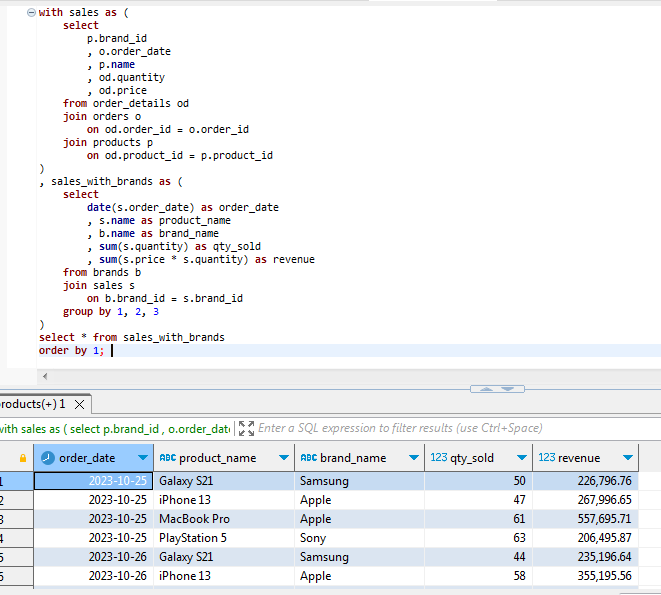
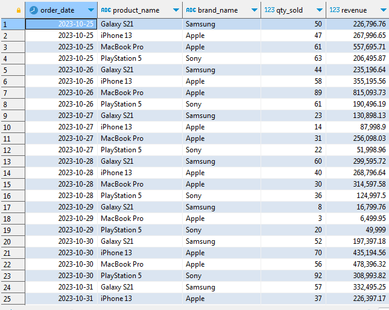
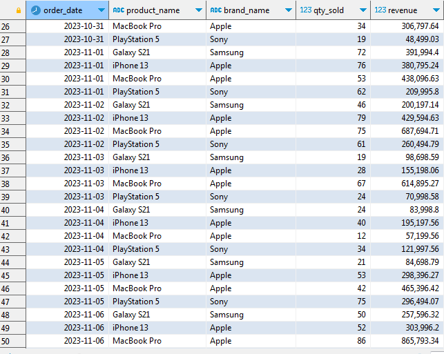
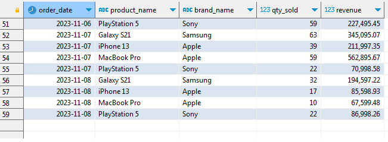

### TASK 2
#### Tampilkan tabel dengan kolom berikut:
- order_date —> date, contoh: 2023-10-25
- product_name
- brand_name
- qty_sold
- revenue

#### Step 1
Membuat tabel CTE 'sales' dari tabel order_details, orders, dan products.
```
with sales as (
	select
		p.brand_id
		, o.order_date
		, p.name
		, od.quantity
		, od.price
	from order_details od
	join orders o
		on od.order_id = o.order_id
	join products p
		on od.product_id = p.product_id
)
```

#### Step 2
Membuat tabel CTE 'sales_with_brands' dari tabel CTE sales dan brands.
```
, sales_with_brands as (
	select
		date(s.order_date) as order_date
		, s.name as product_name
		, b.name as brand_name
		, sum(s.quantity) as qty_sold
		, sum(s.price * s.quantity) as revenue
	from brands b
	join sales s
		on b.brand_id = s.brand_id
	group by 1, 2, 3
)
```

#### Step 3
Menampilkan semua kolom yang diminta pada soal.
```
select * from sales_with_brands
order by 1;
```

#### Screenshot








