### TASK 3
#### Langkah-langkah demo setup dbt dari 0

#### 1) Membuat direktori baru 'dbt-demo'
```
mkdir dbt-demo
```
Pindah ke direktori dbt-demo
```
cd dbt-demo
```


#### 2) Buat file [docker-compose.yml](../docker-compose.yml)
```
vi docker-compose.yml
```
Paste code dan save file

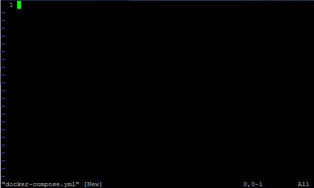

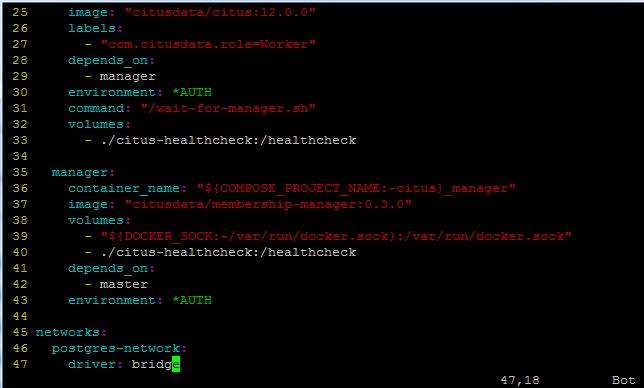

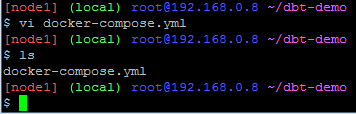

#### 3) Jalankan docker compose
```
docker compose up -d
```

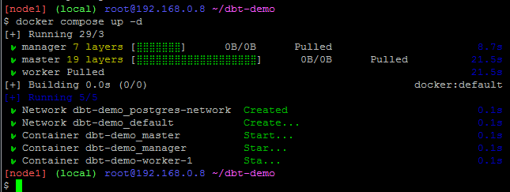

Cek status container apakah sudah berjalan
```
docker ps
```

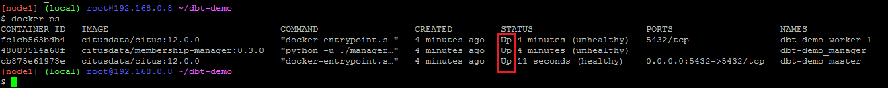

#### 4) Buat venv
```
python -m venv .venv
```
Cek apakah .venv sudah ada
```
ls -a
```

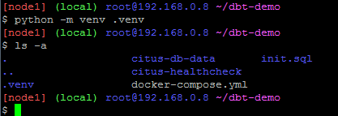

#### 5) Aktifkan venv
```
source .venv/bin/activate
```

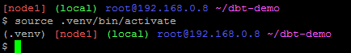

#### 6) Install DBT-postgres
```
pip install dbt-postgres
```

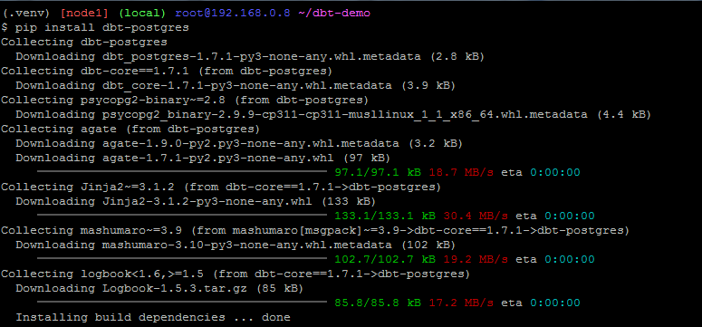

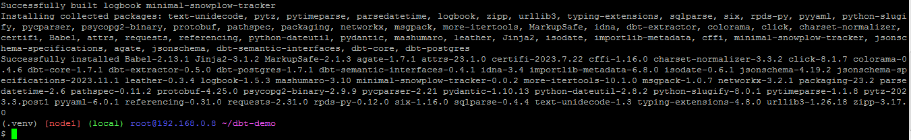

#### 7) Simpan list packages DBT
Tampilkan list DBT packages yang sudah terinstall
```
pip freeze | grep dbt
```


Simpan ke dalam file baru ['requirements.txt'](../requirements.txt) agar jika ingin menginstall DBT dengan packages yang sama, bisa dengan ```pip install -r requirements.txt```
```
pip freeze | grep dbt >> requirements.txt
```

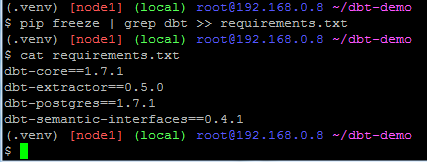

#### 8) Buat DBT project
```
dbt init my_project
```
Pilih postgres (1) dan input data profile sesuai dengan yang sudah dibuat di [docker-compose.yml](../docker-compose.yml)

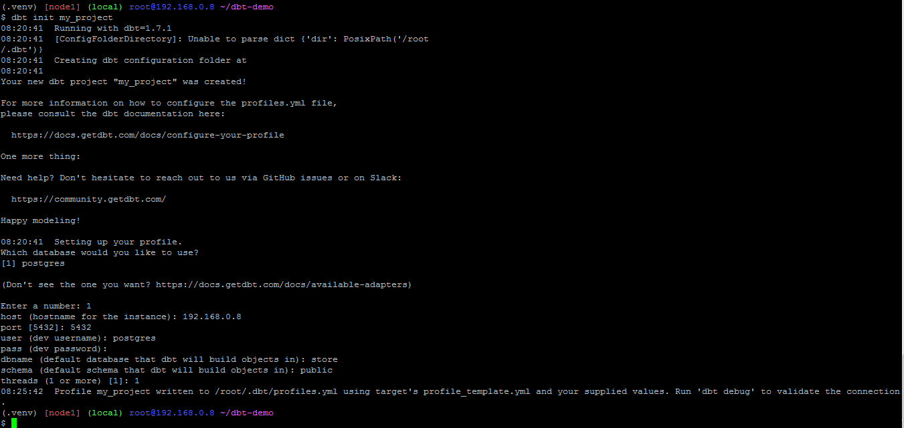

Secara default, DBT akan membuat dbt profile di home direktori ```~/.dbt/profiles.yml```

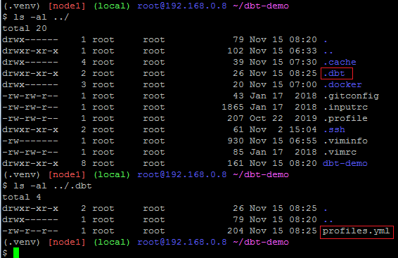

Untuk mengubah profile dan mengubah path direktori DBT profile, bisa dengan membuat direktori baru dbt-profiles dan mengubah variabel path direktori DBT profile
```
mkdir dbt-profiles
export DBT_PROFILES_DIR=$(pwd)/dbt-profiles
```

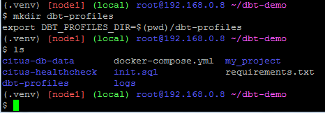

Lalu bisa membuat profile baru atau menggunakan profile yang diinput sebelumnya. Untuk membuat profile baru:
```
touch dbt-profiles/profiles.yml
```
Setelah itu isi profiles.yml dengan format berikut sesuai kebutuhan.
```
my_project:
  outputs:

    dev:
      type: postgres
      threads: 1
      host: <your_host>
      port: <your_port>
      user: <your_username>
      pass: <your_password>
      dbname: <your_database>
      schema: <your_schema>

  target: dev
```
Untuk menggunakan profile yang diinput sebelumnya, bisa mengcopy file profiles.yml dari home direktori ke direktori dbt-profiles yang baru dibuat
```
cp ../.dbt/profiles.yml dbt-profiles
```

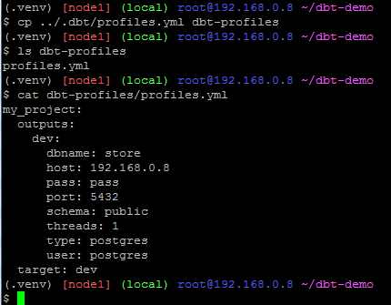

#### 9) Connect ke DBeaver dan jalankan query pada [init.sql](../init.sql)

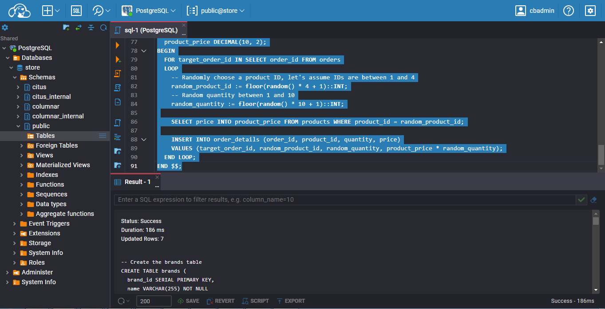

Setelah di refresh

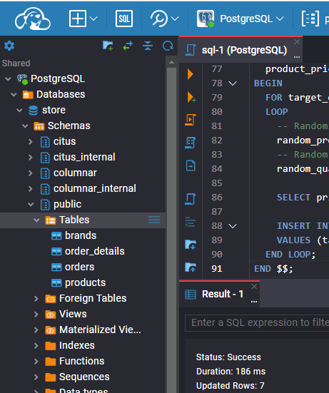

#### 10) Setup DBT project configuration
Edit models pada ```my_project/dbt_project.yml``` agar menjadi seperti ini:
```
models:
  my_project:
    # Config indicated by + and applies to all files under models/example/
    store:
      +schema: public
      +database: store
    store_analytics:
      +materialized: table
      +schema: analytics
      +database: store
```

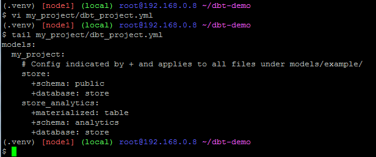

#### 11) Setup source
Buat direktori store di dalam direktori models
```
mkdir my_project/models/store
```
Lalu buat file ['schema.yml'](../my_project/models/store/schema.yml) di dalam direktori store
```
vi my_project/models/store/schema.yml
```

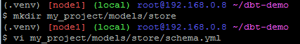

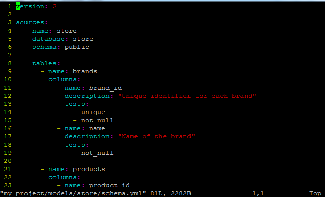

#### 12) Buat model
Buat direktori baru 'store_analytics' di dalam direktori models
```
mkdir my_project/models/store_analytics
```

Kemudian definisikan tabel dengan membuat file ['daily_sales.sql'](../my_project/models/store_analytics/daily_sales.sql) di direktori store_analytics
```
vi my_project/models/store_analytics/daily_sales.sql
```
Dan buat file ['schema.yml'](../my_project/models/store_analytics/schema.yml) di direktori yang sama
```
vi my_project/models/store_analytics/schema.yml
```

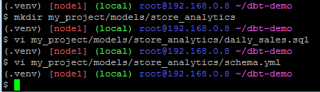

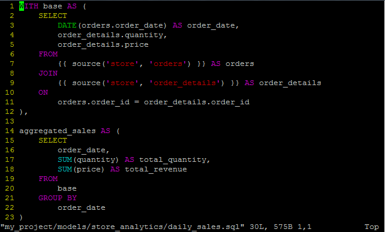

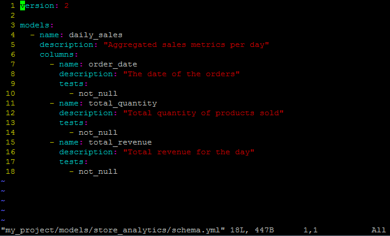

#### 13) Run dan test model yang sudah dibuat
```
cd my_project
dbt run
dbt test
```

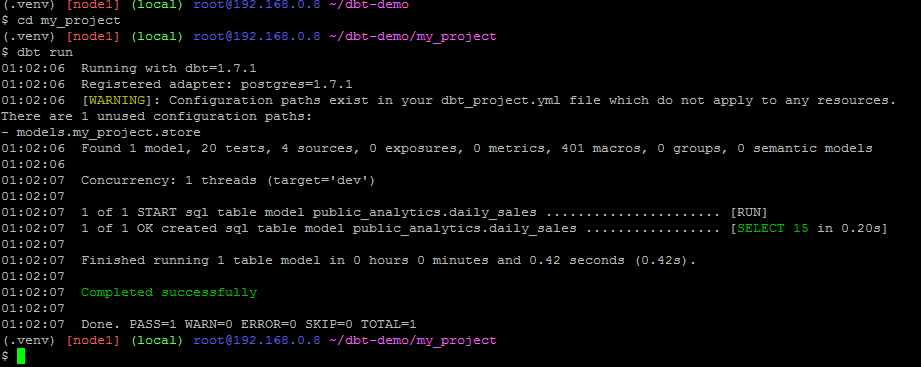

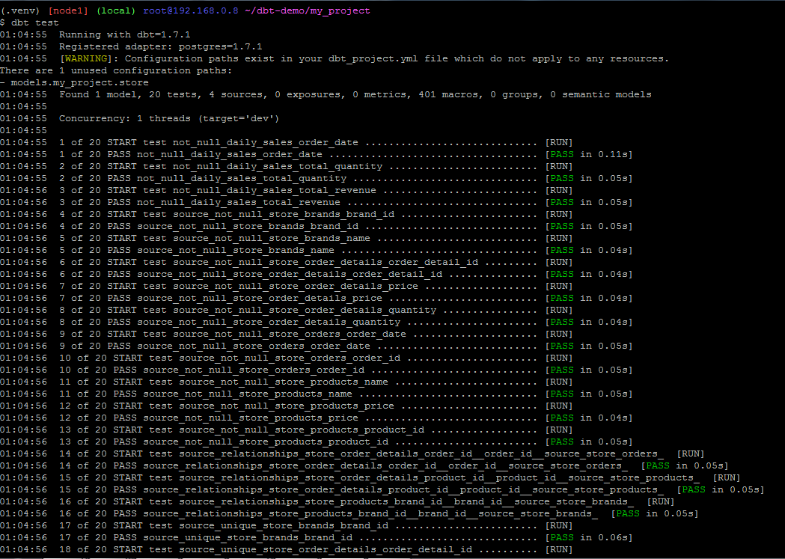

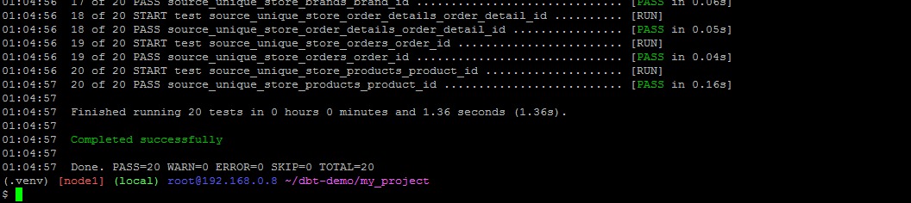


#### 14) Cek hasilnya di DBeaver
Refresh

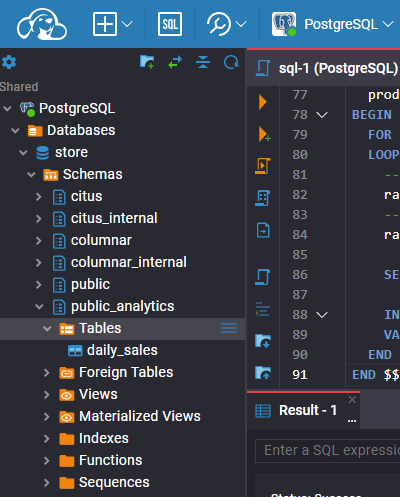

Jalankan query berikut untuk mengecek tabel daily_sales
```
select
    *
from store.public_analytics.daily_sales
```

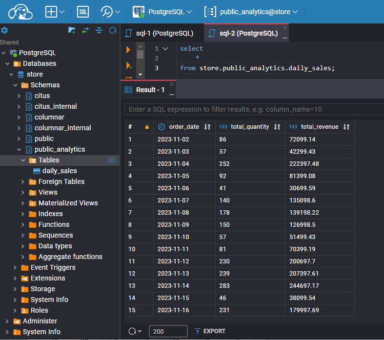
