### TASK 4
#### 1. Make a model named on `stg_order_details` containing the following info:
- order_date
- quantity
- price
- brand name
- product name

#### 2. Base on `stg_order_details`, make another model named `fct_per_brand_daily_sales` containing per brand daily sales:
- brand_name
- order_date
- total_quantity
- total_revenue

#### 3. Add test to make sure that `fct_per_brand_daily_sales` has `unique combination` of `order_date` and `brand_name`


#### Langkah-langkah
1) Buat file packages.yml di direktori my_project
```
packages:
  - package: dbt-labs/dbt_utils
    version: 1.1.1
```

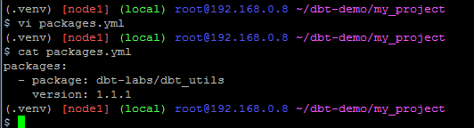

2) Tambahkan schema baru dan configurasi lainnya di file dbt_project.yml
```
    store__stg:
      +materialized: table
      +schema: _stg
      +database: store
    store_mart:
      +materialized: table
      +schema: mart
      +database: store
```

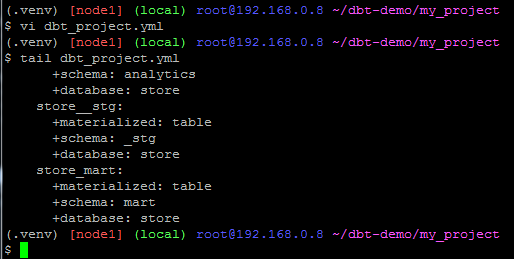

3) Buat direktori store__stg di direktori models lalu buat file stg_order_details.sql dan file schema.yml
```
select
   orders.order_date
   , details.quantity
   , details.price
   , brands.name as brand_name
   , products.name as product_name
from {{ source ('store', 'orders')}} as orders
left join {{ source ('store', 'order_details') }} as details
   on orders.order_id = details.order_id
left join {{ source ('store', 'products') }} as products
   on details.product_id = products.product_id
left join {{ source ('store', 'brands') }} as brands
   on brands.brand_id = products.brand_id
```


```
version: 2

models:
  - name: stg_order_details
    description: "staging model for order details"
    tests:
      - dbt_utils.unique_combination_of_columns:
          combination_of_columns:
            - order_date
            - brand_name
            - product_name
```

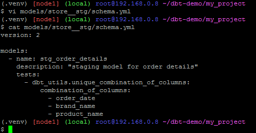

4) Buat direktori store_mart di direktori models lalu buat file fct_per_brand_daily_sales.sql dan file schema.yml
```
select
  brand_name
  , order_date
  , sum(quantity) as total_quantity
  , sum(price) as total_revenue
from {{ ref ('stg_order_details') }}
group by 1, 2
```

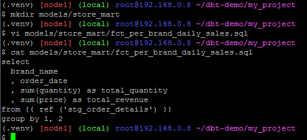

```
version: 2

models:
  - name: fct_per_brand_daily_sales
    description: "daily_sales_for_each_brand"
    tests:
      - dbt_utils.unique_combination_of_columns:
          combination_of_columns:
            - order_date
            - brand_name
```

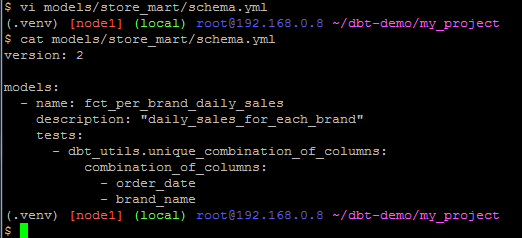

5) Install packages yang sudah dibuat
```
dbt deps
```

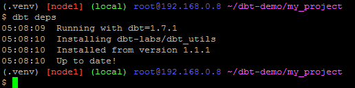

6) Run dan test models yang sudah dibuat
```
dbt run
dbt test
```

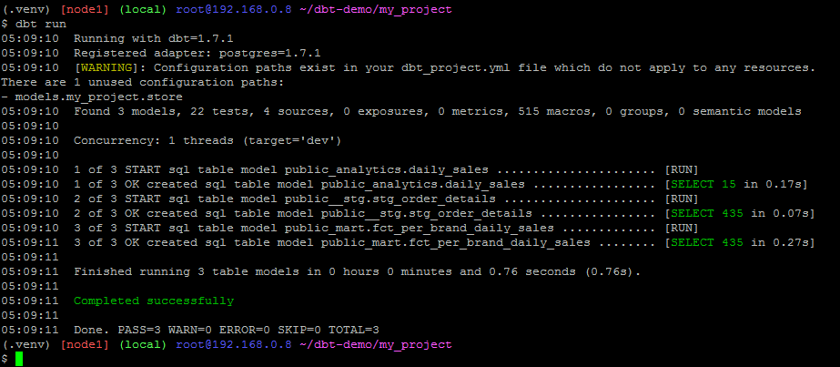


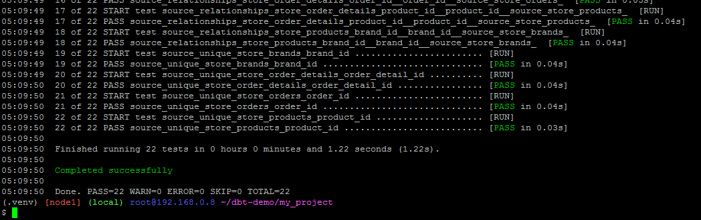


7) Cek hasil di DBeaver

Refresh

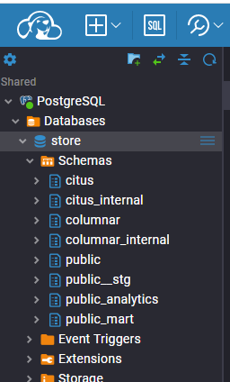

Tabel stg_order_details

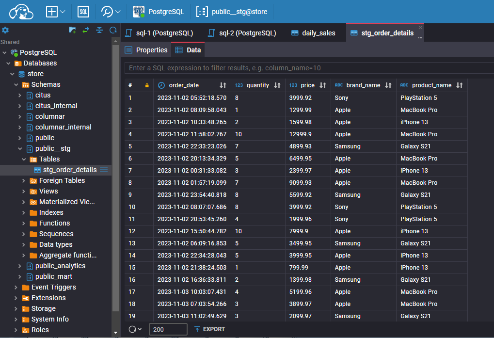

Tabel fct_per_brand_daily_sales

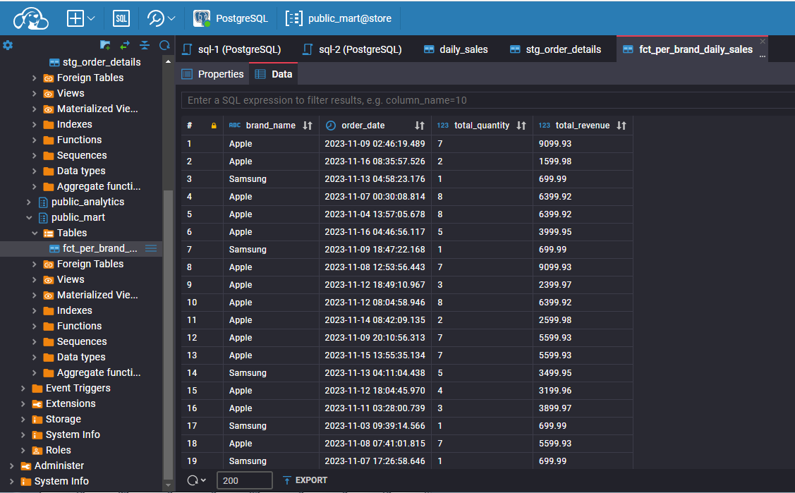

