### TASK 5
#### 1. Update stg_order_details, add the following columns:
- customer_phone
- normalized_customer_phone (use macro to normalize the phone number)
- country (based on normalized_customer_phone):
    - If the phone number is started with 62, the country should be Indonesia
    - If the phone number is started with 91, the country should be India

#### 2. Base on stg_order_details, make another model named fct_per_country_daily_sales containing per country daily sales:
- country
- order_date
- total_quantity
- total_revenue

#### Langkah-langkah
1) Buat file normalize_phone_number.sql di direktori macros
```

    ltrim({{ column_name }}, '+')

```

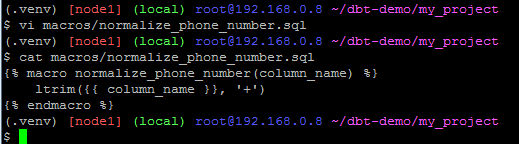

2) Buat file stg_order_details_normalized.sql di direktori store__stg
```
with details as (
  select
    orders.order_date
    , details.quantity
    , details.price
    , brands.name as brand_name
    , products.name as product_name
    , orders.customer_phone
    , {{ normalize_phone_number ('orders.customer_phone') }} as normalized_customer_phone
  from {{ source ('store', 'orders')}} as orders
  left join {{ source ('store', 'order_details') }} as details
    on orders.order_id = details.order_id
  left join {{ source ('store', 'products') }} as products
    on details.product_id = products.product_id
  left join {{ source ('store', 'brands') }} as brands
    on brands.brand_id = products.brand_id
)
select
  *
  , case
      when normalized_customer_phone like '62%' then 'Indonesia'
      when normalized_customer_phone like '91%' then'India'
  end as country
from details
```

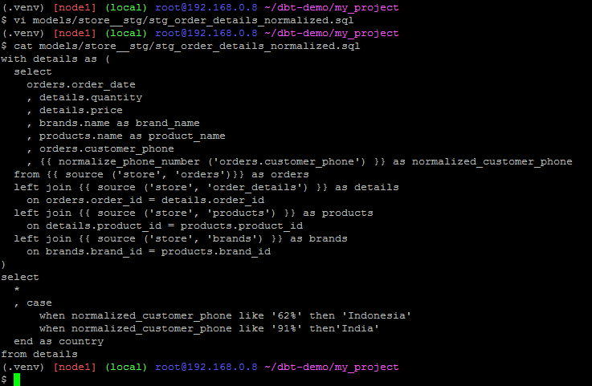

3) Tambahkan model yang dibuat ke dalam file schema.yml di direktori store__stg
```
  - name: stg_order_details_normalized
    description: "normalized phone number in order details"
    columns:
      - name: customer_phone
        tests:
          - not_null
      - name: normalized_customer_phone
        tests:
          - not_null
      - name: country
        tests:
          - not_null
```

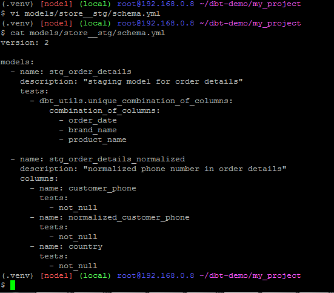

4) Run dan test model yang sudah dibuat
```
dbt run
dbt test
```

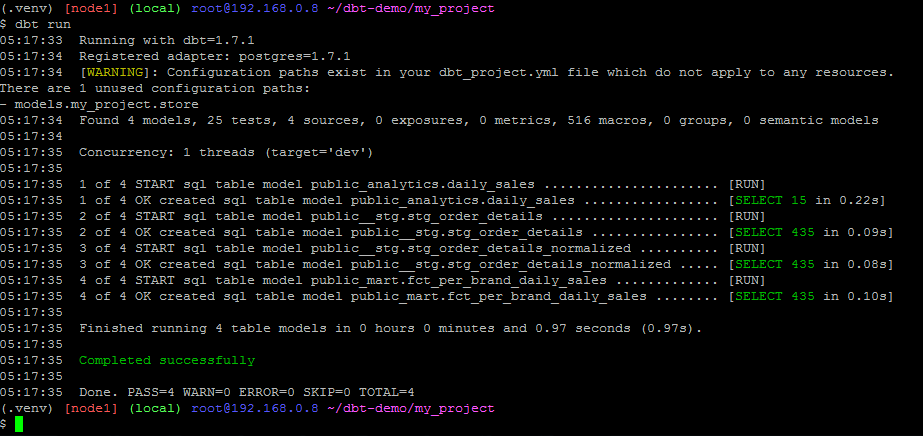

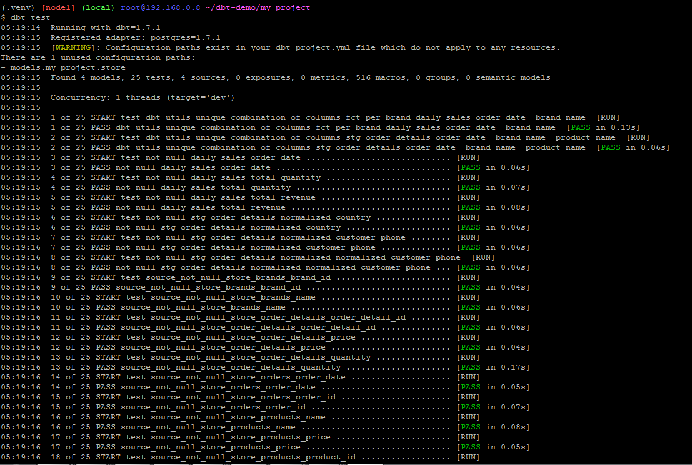

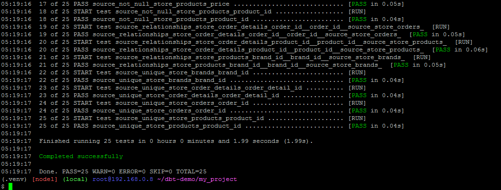

5) Buat file fct_per_country_daily_sales.sql di direktori store_mart
```
select
  country
  , order_date
  , sum(quantity) as total_quantity
  , sum(price) as total_revenue
from {{ ref ('stg_order_details_normalized') }}
group by 1, 2
order by 2
```

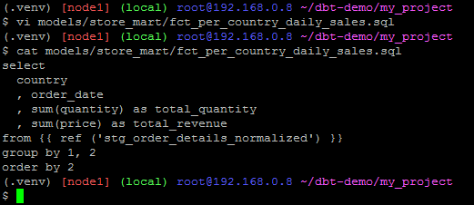

6) Tambahkan model yang dibuat ke dalam file schema.yml di direktori store_mart
```
  - name: fct_per_country_daily_sales
    description: "daily sales for each country"
    columns:
      - name: country
        tests:
          - not_null
```


7) Run dan test model yang sudah dibuat
```
dbt run
dbt test
```

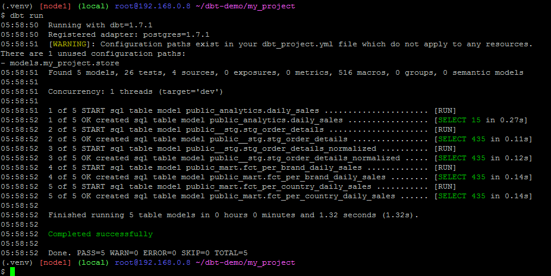

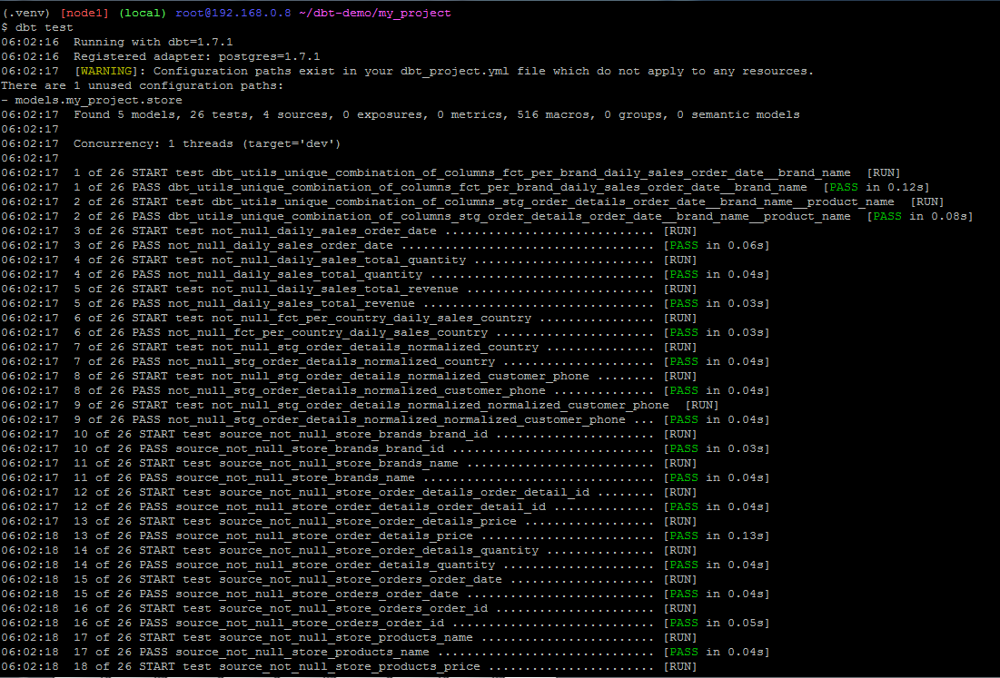

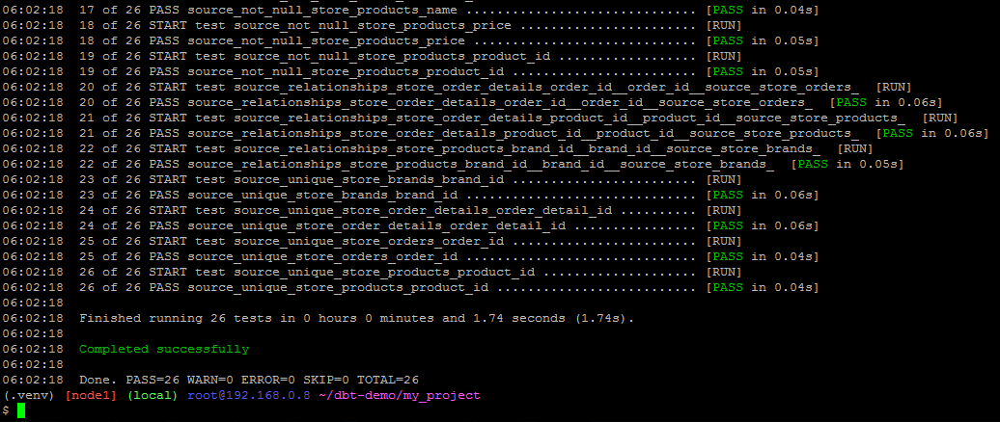

8) Cek hasil di DBeaver

Refresh

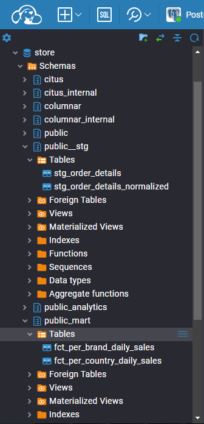

Tabel stg_order_details_normalized

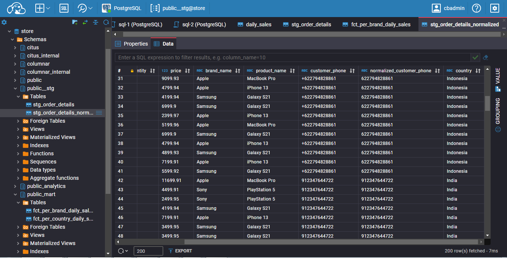

Tabel fct_per_country_daily_sales

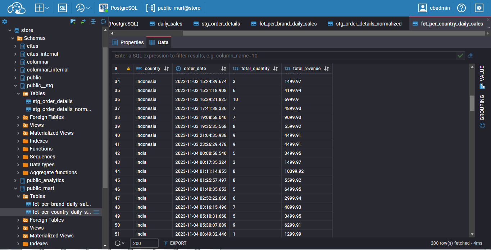
